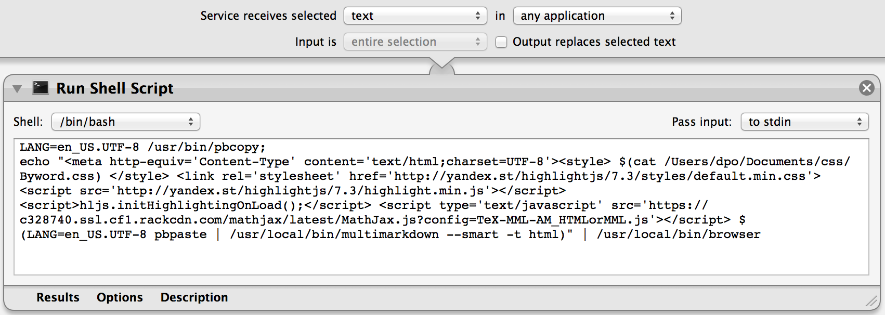

# Markdown Preview Service in Browser

This is a simple OSX service that allows you to select Markdown code and preview it in the browser. It supports MathJax and code highlighting. I use it to send plain text e-mails containing Markdown code, including math using LaTeX syntax and code.

Because it is a service, you can use it in any application. Type Markdown in your favorite text editor, select all or a portion of your document, activate your service, and voilà!

## Features

* Supports [Mathjax](http://www.mathjax.org) using LaTeX syntax
* Makes it easy to copy and paste between Markdown and LaTeX documents because the math delimiters are the same, i.e., you use `\(`, `\)`, `\[` and `\]`, not `\\(`, `\\[`, etc.
* Code highlighting via [highlight.js](http://highlightjs.org)

## Requirements

The only requirements are [MultiMarkdown](http://fletcherpenney.net/multimarkdown) and the simple [browser script](https://gist.github.com/defunkt/318247). I strongly recommend to use [Homebrew](http://brew/sh):
````
brew install multimarkdown
brew install browser
````

## Installing

Open Automator and create a new service. In the left-most column, select `Utilities` and in the next column, select `Run Shell Script`. Your service "receives selected text in any application". Make sure the box "Output replaces selected text" is left unchecked.

Paste the contents of `md-preview-browser.txt` into the shell script body. The result should look similar to this:



(Note that I don't update the screenshot as often as I update the code.)

Save your workflow and exit automator. I choose to name it `md-preview-browser`.

## Testing

You should now be able to select the following snippet and choose `md-preview-browser` from the `Services` contextual menu. The rendered bit should appear in your default browser.


    # This is a just a test

    This test includes the [Dennis-Moré condition](http://dx.doi.org/10.1137/1019005)
    \[
    \lim_{k \to \infty}
    \frac{\|(H_k - \nabla^2 f(x_*)) (x_{k+1} - x_k)\|}{\|x_{k+1} - x_k\|} = 0
    \]
    in a display math environment and also some inline math: \(f \in \mathcal{C}^2\).

    ## Bonus

    As a bonus, here is some Python code:

        @requires_authorization
        def somefunc(param1='', param2=0):
            r'''A docstring'''
            if param1 > param2: # interesting
                print 'Gre\'ater'
            return (param2 - param1 + 1 + 0b10l) or None

        class SomeClass:
            pass

## Notes

In some places, the LaTeX and Markdown syntaxes conflict. For example, avoid using underscores to emphasize text. The use of stars in formulae can also produce unpredictable results. Open an issue to let me know.

Enjoy!


[](https://bitdeli.com/free "Bitdeli Badge")

